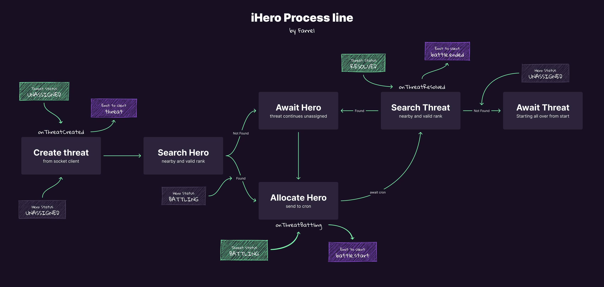

### iHeros - Teste Fullstack

Este é o teste usado por nós aqui da ZRP para avaliar tecnicamente os candidatos a nossas vagas de desenvolvedores Fullstack. Se você estiver participando de um processo seletivo para nossa equipe, certamente em algum momento receberá este link, mas caso você tenha chegado aqui "por acaso", sinta-se convidado a desenvolver nosso teste e enviar uma mensagem para nós no e-mail jobs@zrp.com.br.

Aqui na ZRP nós aplicamos este mesmo teste para as vagas em todos os níveis, ou seja, um candidato a uma vaga de dev júnior fará o mesmo teste de um outro candidato a uma vaga de dev sênior, mudando obviamente o nosso critério de avaliação do resultado do teste e nossa expectativa de passos entregues.

Nós fazemos isso esperando que as pessoas mais iniciantes entendam qual o modelo de profissional que temos por aqui e que buscamos para o nosso time. Portanto, se você estiver se candidatando a uma vaga mais iniciante, não se assuste, e faça o melhor que você puder e os passos que conseguir!

## Rodar o projeto

Para rodar o projeto, você precisará ter o npm, yarn e pnpm instalado em sua máquina. Caso não tenha, você pode baixar o Node.js [aqui](https://nodejs.org/en/), o Yarn [aqui](https://yarnpkg.com/) e o Pnpm [aqui](https://pnpm.io/). Além do node, você precisará ter o Docker e o Docker Compose instalados em sua máquina. Caso não tenha, você pode baixar o Docker [aqui](https://www.docker.com/get-started) e o Docker Compose [aqui](https://docs.docker.com/compose/install/).

Para baixar e iniciar o setup do projeto, você pode seguir os passos abaixo:

1. Clone o repositório:

```bash
# Clone the repository
$ git clone https://github.com/farreltobias/iHeros.git iHeros

# Enter the project directory
$ cd iHeros

# Install the dependencies
$ pnpm run setup
``` 

O comando `pnpm run setup` irá instalar as dependências de todos os projetos. Após a instalação, rode o comando `pnpm run build:db` para iniciar os bancos de dados nos containers do Docker e rode `pnpm run seed` para popular o banco de dados com dados iniciais. (Rank e Danger). Para rodar o projeto, você pode rodar os seguintes comandos:

[IMPORTANTE] Antes de rodar o projeto, você precisa criar um arquivo `.env` na raiz de cada projeto seguindo as instruções do arquivo `.env.example`. 

Para o frontend, o `STRAPI_TOKEN` precisa ter pelo menos os acesos "Read-only".

Para o micro-serviço de heróis, o `STRAPI_TOKEN` precisa ter pelo menos os seguintes acessos:

- Hero:
  - findManyNearby
  - findOne
  - update
  - find
- Rank
  - findOne
  - find

```bash
# Run the backend
$ pnpm run start:backend

# Run the frontend
$ pnpm run start:frontend

# Run the microservice
$ pnpm run start:microservice
```

Pronto, o projeto estará rodando em `http://localhost:3000`. Você verá os heróis sendo alocados para as ameaças em tempo real. Lembrando que é necessário cadastrar os heróis na plataforma admin, rodando em `http://localhost:1337/admin`.

Para rodar os testes no micro-serviço, você pode rodar o seguinte comando:

```bash
# Run the tests
$ cd microservice && pnpm run test
```

Para acessar o prisma studio, você pode rodar o seguinte comando:

```bash
# Run prisma studio
$ cd microservice && pnpm prisma studio
```

## Como funciona?

O projeto é dividido em 3 partes:

- Backend: O backend é responsável por gerenciar os heróis e suas classes (ranks). Ele é construído com o Strapi, um headless CMS que fornece uma API REST para gerenciar os dados. O backend não é responsável por alocar os heróis para as ameaças, apenas por gerenciar os dados dos heróis e ranks.
- Frontend: O frontend é responsável por gerenciar os heróis e suas classes (ranks). Ele é construído com o Next.js, um framework React para construir aplicações web. O frontend consome a API REST do Strapi para gerenciar os dados dos heróis e ranks (não construído ainda) e consome o socket do micro-serviço para exibir as ameaças, o status da ameaça e a alocação dos heróis em tempo real (última parte não construída ainda).
- Micro-serviço: O micro-serviço é responsável por alocar os heróis para as ameaças automaticamente. Ele é construído com o NestJS, um framework Node.js para construir aplicações escaláveis. O micro-serviço consome o socket da ZRP (ficcionalmente da ONU) que emite eventos de ameaças a cada 30 segundos. Ele aloca os heróis de acordo com a localização e rank adequado ao nível de ameaças.

O processo de alocação dos heróis é feito da seguinte forma:

1. O micro-serviço escuta os eventos de ameaças emitidos pelo socket da ZRP.
2. Quando um evento de ameaça é emitido, o micro-serviço guarda a ameaça em banco de dados separado, com as informações das ameaças e busca os heróis mais próximos da localização da ameaça.
3. O micro-serviço aloca os heróis de acordo com o rank adequado ao nível de ameaças. Se não houver heróis disponíveis, ele não aloca nenhum herói e deixa a ameaça em espera com o status "UNASSIGNED".
4. O micro-serviço desaloca os heróis após o tempo de batalha com a ameaça (por meio de um cron scheduler). O tempo de batalha é definido de acordo com o rank do herói e o nível da ameaça.
5. O micro-serviço atualiza o status da ameaça para "BATTLING" e guarda o tempo de batalha com a ameaça.
6. Após o tempo de batalha, o micro-serviço atualiza o status da ameaça para "RESOLVED" e guarda o tempo de batalha com a ameaça.
7. O herói que batalhou então procura a próxima ameaça mais próxima com o status "UNASSIGNED" e repete o processo.
8. Se não houver mais ameaças com o status "UNASSIGNED", o herói fica em espera até que uma nova ameaça seja emitida.
   
A imagem abaixo mostra o fluxo de alocação dos heróis para as ameaças com mais detalhes:



## Mais informações do desafio

### Instruções

Você deverá criar um fork deste projeto, e desenvolver em cima do seu fork. **Use o README principal do seu repositório para nos contar como foi resolver seu teste**, as decisões tomadas, como você organizou e separou seu código, e principalmente **as instruções de como rodar seu projeto**.

Lembre-se que este é um teste técnico e não um concurso público, portanto, não existe apenas uma resposta correta. Mostre que você é bom e nos impressione, mas não esqueça do objetivo do projeto.

Nós não definimos um tempo limite geral para resolução deste teste, o que vale para nós é o resultado final e a evolução da criação do projeto até se atingir este resultado. Você deve alinhar junto com o RH **quais passos você irá implementar** e **quanto tempo você demorará para fazê-los**.

#### Descrição

> Rede de cadastro(test backend) e distribuição (test frontend) de heroes, levando em consideração o nível da ameaça que estaria atacando uma determinada região.

Você está no ano de 3150 e está a frente do setor de tecnologia responsável pelo desenvolvimento do sistema de gerenciamento de distribuição de heróis para combater ameaças. O sistema deve monitorar as alertas de ameças providas pela ONU e alocar os heróis para cada nova ameaça existente no globo terrestre, designando sempre claramente o mais próximo do local.

#### Etapas

Lembre-se de avisar o RH quais etapas você entregará e sua expectativa de prazo de entrega!

##### Nível 1 - Autenticação e Cadastro

Monte um sistema onde o usuário administrativo pode se cadastrar e se autenticar, para uma plataforma logada.

##### Nível 2 - CRUD

Na plataforma logada, o administrador deve conseguir cadastrar, editar, remover e listar heróis. Leia as próximas etapas para modelar corretamente os atributos de um herói.

##### Nível 3 - Alocação de heróis

Para essa parte do desafio, você deve ouvir as notificações de um sistema de emissão desenvolvido pela ONU que informa ameaças de maneira aleatória pelo globo.

O líder de operações do departamento de heróis ordenou as seguintes regras para garantir que as ameaças sejam devidamente resolvidas:

- Cada **Herói** e cada **Ameaça** tem um rank
- Os heróis devem ser alocados de acordo com sua localização (mais próximo sempre) e rank adequado ao nível de ameaças
- Após determinado tempo os heróis devem ser desalocados
- Os ranks são os seguintes:

**Heroes**
Classe S, A, B e C.

**Ameaças**
Nível God, Dragon, Tiger e Wolf.

- Heróis do rank classe "S" tem prioridade sobre ameaças do tipo "God" - uma batalha com uma ameaça desse nível deve durar no mínimo 5 minutos e no máximo 10 minutos;
- Heróis do rank classe "A" tem prioridade sobre ameaças do tipo "Dragon" - uma batalha com uma ameaça desse nível deve durar no mínimo 2 minutos e no máximo 5 minutos;
- Heróis do rank classe "B" tem prioridade sobre ameaças do tipo "Tiger" - uma batalha com uma ameaça desse nível deve durar no mínimo 10 segundos e no máximo 20 segundos;
- Heróis do rank classe "C" tem prioridade sobre ameaças do tipo "Wolf" - uma batalha com uma ameaça desse nível deve durar no mínimo 1 segundo e no máximo 2 segundos;

Você devera consumir um socket (construído utilizando o **socket.io**) que retorna as informações das ameaças detectadas.

Cada ameça tem o seguinte formato:

```json
{
    "location": [{
        "lat": -5.836597,
        "lng": -35.236007,
    }],
    "dangerLevel": "Dragon",
    "monsterName": "Black Dragon",
    "monster": {
      "key": "value"
    }
}
```

A url do serviço é `https://zrp-challenges-dev-production.up.railway.app/`, esse serviço emite um evento `occurrence`, indicando uma nova ameaça, a cada 30s.

Você pode ver as ameaças em tempo real acessando https://zrp-challenges-dev-demo-production.up.railway.app/.

Não sabe como se conectar e ouvir a eventos do socket.io? Veja a documentação [nesse link](https://socket.io/docs/v4/).

##### Nível 4 - Histórico de ameaças

Nos mostre em uma tela bonita e chamativa qual herói combateu qual ameaça e quanto tempo durou a ameaça.

##### Nível 5 - Alocações inteligentes

Você pode alocar o dobro de heróis de ranking menor para lidar com uma ameaça de ranking superior caso eles estejam mais próximos que o herói devido da ameaça daquele nível.

Ou seja, o dobro da força heroica é o suficiente para batalhar com a ameaça de nível superior.

### Tecnologias

**Frontend**

- Vue
- Angular
- React

**Backend**

- Node.Js
- Ruby
- Python
- Elixir
- C#
- Go
- PHP
- Java

Para persistir os dados utilize o meio que achar mais conveniente :).

### O que iremos avaliar

- Modelagem de Dados
- Domínio da Linguagem
- Legibilidade do Código
- Estrutura do Código
- Organização do Código
- Design Patterns
- Manutenibilidade do Código
- Testes Unitários e Cobertura de Testes
- Uso do git
- Virtualização e documentação do ambiente
